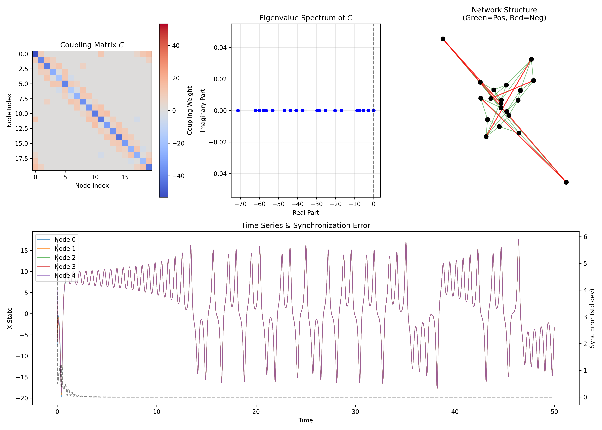

# Synchronization of Chaotic Systems with Negative Couplings

[](https://www.python.org/)
[](https://opensource.org/licenses/MIT)
[](https://github.com/zapata131/simulation-chaotic-systems-negative-couplings)

A complex network simulation exploring the synchronization of Lorenz chaotic oscillators coupled via mixed-sign (positive and negative) diffusive couplings. This project reproduces and extends the findings of Solís-Perales & Zapata (2013), demonstrating that networks can achieve synchronization even with negative ("inhibitory") connections, provided the coupling matrix maintains a stable eigenspectrum.



## 📜 Abstract

Ideally, complex networks require non-negative off-diagonal elements in their coupling matrices (cooperative interactions) to ensure stability and synchronization. However, many real-world systems, such as neural networks and social dynamics, involve inhibitory or antagonistic interactions (negative couplings). 

This project simulates a **Small-World Network** (Watts-Strogatz) of $N=20$ Lorenz oscillators where a fraction of the edges have negative weights. We show that by satisfying a relaxed stability condition—where the non-zero eigenvalues of the zero-row-sum coupling matrix remain in the left-half complex plane—the network can still achieve global synchronization.

## 🚀 Features

- **Lorenz Oscillator Dynamics**: Integration of the classic 3D chaotic system ($\sigma=10, \rho=28, \beta=8/3$).
- **Complex Network Topology**: Watts-Strogatz small-world graph generation ($N=20, k=4, p=0.1$).
- **Mixed-Sign Couplings**: Implementation of edges with both positive (cooperative) and negative (competitive) weights.
- **Spectral Stability Check**: Automatic verification of the coupling matrix eigenvalues to ensure synchronizability.
- **Visualization**: comprehensive plotting of the connectivity matrix, eigenvalue spectrum, network graph, and time-series synchronization.

## 🔬 Mathematical Model

The network dynamics are described by:

$$ \dot{\mathbf{x}}_i = \mathbf{f}(\mathbf{x}_i) + C \sum_{j=1}^{N} A_{ij} (\mathbf{x}_j - \mathbf{x}_i) $$

Where:
- $\mathbf{x}_i \in \mathbb{R}^3$ is the state of the $i$-th Lorenz oscillator.
- $\mathbf{f}(\mathbf{x}_i)$ represents the isolated Lorenz dynamics.
- $A_{ij}$ are the adjacency weights (can be negative).
- $C$ is the global coupling strength.

To ensure diffusive coupling, the coupling matrix $\mathcal{C}$ is constructed such that rows sum to zero:
$$ \mathcal{C}_{ij} = A_{ij}, \quad \mathcal{C}_{ii} = -\sum_{j \neq i} A_{ij} $$

Synchronization depends on the spectrum of $\mathcal{C}$. Specifically, if all non-zero eigenvalues $\lambda_k$ obey $\text{Re}(\lambda_k) < 0$ (and fit within the bounded stability region of the Master Stability Function for the Lorenz system), synchronization is possible.

## 🔑 Stability Criteria for Synchronization

According to the findings of **Solís-Perales & Zapata**, the conditions for synchronization can be relaxed compared to standard network theory.

1.  **Standard Condition (Traditional)**: Usually requires the off-diagonal elements of the coupling matrix to be non-negative ($A_{ij} \ge 0$), implying cooperative interactions.
2.  **Relaxed Condition (This Work)**:
    - The non-negativity of off-diagonal elements is **not necessary**.
    - The critical requisite is spectral: the **eigenvalues of the coupling matrix** must still provide a stable region for the synchronized state.
    - **Conjecture**: The synchronizability depends on the second largest eigenvalue $\tilde{\lambda}_2$ of the coupling matrix $\mathcal{C}$ satisfying:
      $$ |\tilde{\lambda}_2| \ge |\bar{d}| $$
      Where $\bar{d}$ represents the maximum Lyapunov exponent (or divergence) of the isolated dynamical system.
    - Effectively, the "net" coupling must be strong enough and distributed such that the Laplacian-like matrix $\mathcal{C}$ remains stable (negative definite on the transverse manifold), even if some individual links are varying or negative.

## 📊 Results Explanation

The simulation generates `lorenz_network_simulation.png` containing four key panels:

1.  **Coupling Matrix $C$**: Visualizes the weight distribution. Red pixels indicate positive couplings, while blue pixels show negative couplings. The diagonal is dominant (strongly negative) to satisfy the zero row-sum condition.
2.  **Eigenvalue Spectrum**: Plots the eigenvalues of $C$ in the complex plane. Successful synchronization is predicted when all non-trivial eigenvalues (blue dots) lie strictly to the left of the vertical dashed line (Real Part < 0).
3.  **Network Structure**: A force-directed graph layout. Green edges represent positive connections, while Red edges represent negative ones.
4.  **Time Series & Sync Error**: 
    - The top lines overlay the $x$-trajectories of multiple nodes. Overlapping lines indicate synchronization.
    - The dashed black line tracks the **Global Synchronization Error** (standard deviation across nodes). A decay to zero confirms complete synchronization.

## 💻 Installation & Usage

1.  **Clone the repository**:
    ```bash
    git clone https://github.com/zapata131/simulation-chaotic-systems-negative-couplings.git
    cd simulation-chaotic-systems-negative-couplings
    ```

2.  **Install dependencies**:
    ```bash
    pip install -r requirements.txt
    ```

3.  **Run the simulation**:
    ```bash
    python3 lorenz_network.py
    ```

The script will solve the differential equations, check the spectral stability, and save the results plot to `lorenz_network_simulation.png`.

## Future Directions

Based on this work, several promising avenues for future research and extension include:

1.  **Time-Varying Topologies**: Investigating networks where the coupling matrix $C(t)$ changes over time (switching topology), modelling more realistic biological or social networks.
2.  **Chimera States**: Exploring parameter regimes (e.g., specific negative coupling fractions) where the network splits into coexisting synchronized and desynchronized domains, a phenomenon known as a Chimera state.
3.  **Heterogeneous Oscillators**: Extending the stability analysis to networks of non-identical oscillators (parameter mismatch), which is more robust for real-world applications.
4.  **Biological Modelling**: Applying the "negative coupling" concept to neural mass models (e.g., Jansen-Rit) to simulate inhibitory synaptic connections in brain networks.
5.  **Control Applications**: Using targeted negative couplings as a control strategy to deliberately desynchronize undesirable states (e.g., epileptic seizures).

## 📚 References

This work is based on the research presented at PHYSCON 2013:

> **G. Solís-Perales and J. L. Zapata**, "Synchronization of Complex Networks with Negative Couplings," *2013 International Conference on Physics and Control (PHYSCON 2013)*, San Luis Potosí, Mexico, Aug. 2013.

### Key Concepts Cited
- **Negative Couplings**: The paper challenges the necessity of non-negative off-diagonal elements for synchronization.
- **Relased Stability Condition**: Demonstrates that "non-negativity of such elements is not a necessary condition for stability of the synchronized regime."

---
*Maintained by [Zapata131](https://github.com/zapata131)*
